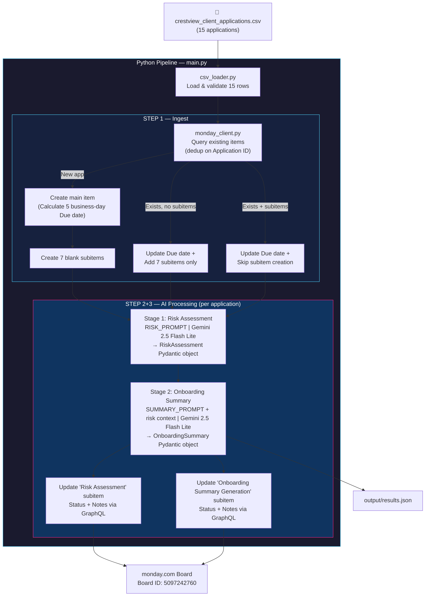
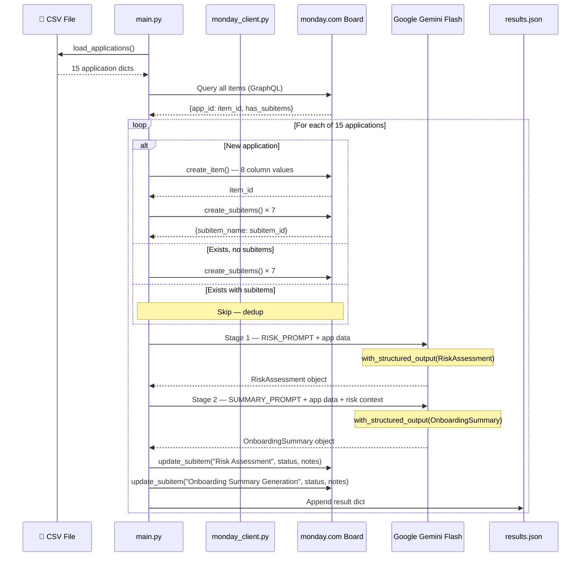
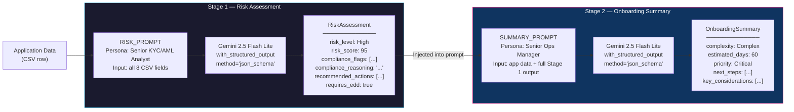
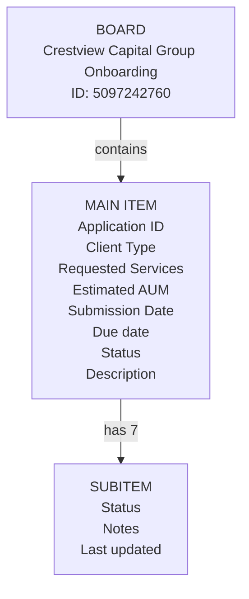
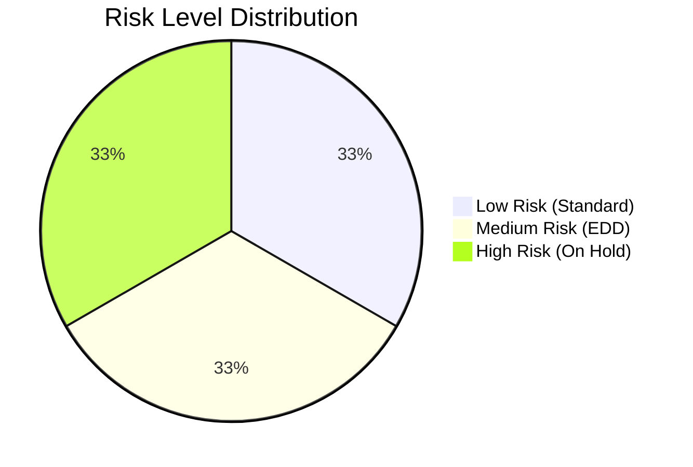
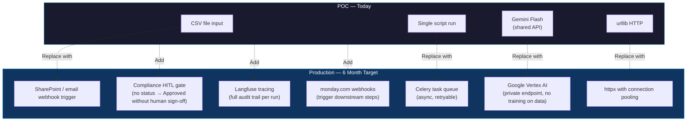

# Technical POC Walkthrough

## Crestview Capital Group — AI-Powered Client Intake Pipeline

> **Stack:** Python 3.12 · LangChain (LCEL) · Google Gemini 2.5 Flash Lite · monday.com GraphQL API · Pydantic v2 · Rich

---

## 1. What the POC Demonstrates

A fully automated, three-step pipeline that takes raw client application data and:

1. **Ingests** 15 client applications from a CSV into a monday.com board — creating structured items with an automatically calculated **Due date** (exactly **5 business days** after the submission date), creating 7 workflow subitems per item, and deduplicating on Application ID so it's safely re-runnable (proactively updating due dates for any existing records on the board).
2. **Risk-assesses** each application using Google Gemini 2.5 Flash Lite via a LangChain chain — producing a structured, audit-defensible compliance report written into the "Risk Assessment" subitem.
3. **Generates an onboarding summary** for each application using a second LangChain chain that explicitly receives the risk output as context — producing operational action plans written into the "Onboarding Summary Generation" subitem.

All results are also persisted to `output/results.json` (now enriched with calculated due dates) for audit and downstream consumption.

---

## 2. System Architecture



---

## 3. Project Structure

```
monday/
├── main.py                    # Orchestrator — runs all 3 steps
├── src/
│   ├── models.py              # Pydantic schemas for structured LLM output
│   ├── prompts.py             # Two LangChain ChatPromptTemplates
│   ├── pipeline.py            # LCEL chains + retry logic
│   ├── csv_loader.py          # CSV reader + field validation
│   ├── monday_client.py       # monday.com GraphQL API client
│   └── console_output.py      # Rich terminal display
├── output/
│   └── results.json           # Full pipeline results (written at runtime)
└── crestview_client_applications.csv
```

---

## 4. The Data Flow in Detail



---

## 5. The AI Integration — Prompt Engineering

### Two-Stage Sequential Design

The pipeline uses two separate LangChain chains connected by **explicit context passing**. This is the key design decision: Stage 2 is not independent — it receives the full Stage 1 output as part of its prompt.



### Why `with_structured_output(method="json_schema")`?

Instead of parsing free-text LLM output (fragile, demo-breaking), we bind the Gemini model directly to a Pydantic schema:

```python
# pipeline.py
chain = RISK_PROMPT | llm.with_structured_output(RiskAssessment, method="json_schema")
result: RiskAssessment = chain.invoke({...})

# result is a validated Pydantic object — no parsing, no regex, no guesswork
print(result.risk_level)        # "High"
print(result.risk_score)        # 95
print(result.compliance_flags)  # ["Offshore Entity", "Nominee Directors", ...]
```

Gemini natively enforces the JSON schema at inference time — if the model tries to return an invalid structure, the API rejects it. This makes the pipeline **production-reliable**, not just demo-reliable.

### Persona Engineering

Both prompts use a specific professional persona to anchor the model's reasoning style:

**Stage 1 — KYC/AML Analyst:**

```
You are a Senior KYC/AML Compliance Analyst at a global investment management firm
regulated by the SEC, FINRA, and international equivalents.
Your reasoning must be explainable and defensible in a regulatory audit.
Do not make vague or unsupported assessments.
```

**Stage 2 — Client Operations Manager:**

```
You are a Senior Client Operations Manager at a global investment management firm.
The risk assessment has already been completed and is provided to you. Use it to inform your summary.
```

The Stage 2 persona explicitly knows it's working _downstream_ of compliance — this prevents it from duplicating compliance work and keeps it focused on operational next steps.

### Sequential Dependency — The Key Design Requirement

The task specification required that "the risk assessment should inform the onboarding summary." We implement this by injecting the full Stage 1 output into the Stage 2 prompt template as named variables:

```python
# pipeline.py — run_onboarding_summary()
chain.invoke({
    # Application fields...
    "application_id": app["application_id"],
    # Risk context from Stage 1 — the dependency
    "risk_level":                      risk.risk_level,
    "risk_score":                       risk.risk_score,
    "compliance_flags":                ", ".join(risk.compliance_flags),
    "requires_enhanced_due_diligence": str(risk.requires_enhanced_due_diligence),
    "compliance_reasoning":             risk.compliance_reasoning,
    "recommended_actions":             "\n".join(f"- {a}" for a in risk.recommended_actions),
})
```

The effect is visible in the output — high-risk clients get compliance prerequisites as their _first_ next steps, not operational setup tasks.

### Temperature Setting

All chains run at `temperature=0.1`. This is deliberate for a compliance use case:

- **Low temperature** → deterministic, consistent assessments
- **Same application run twice** → near-identical risk flags and scores
- **Audit requirement** → reproducible reasoning, not creative variation

---

## 6. The monday.com Integration

### Board Schema (Discovered via API)



### Deduplication Logic

The dedup check uses the `Application ID` column (`text_mm3scqhz`) as the unique key — not the item name, which could have typos:

```python
# monday_client.py — get_existing_items()
# Queries Application ID column and subitem status columns
query = """
query ($boardId: ID!) {
  boards(ids: [$boardId]) {
    items_page(limit: 500) {
      items {
        id
        name
        column_values(ids: ["text_mm3scqhz"]) { id text }
        subitems {
          id
          name
          column_values(ids: ["status"]) { id text }
        }
      }
    }
  }
}
"""
```

Running `main.py` a second time produces: **"Created: 0 new items, Skipped: 15 already on board"** — completely idempotent.

### GraphQL Mutations Used

Three key mutations power the board writes:

```graphql
# 1. Create a main item with column values
mutation (
  $boardId: ID!
  $groupId: String!
  $itemName: String!
  $columnVals: JSON!
) {
  create_item(
    board_id: $boardId
    group_id: $groupId
    item_name: $itemName
    column_values: $columnVals
  ) {
    id
  }
}

# 2. Create a subitem under a parent
mutation ($parentId: ID!, $itemName: String!) {
  create_subitem(parent_item_id: $parentId, item_name: $itemName) {
    id
  }
}

# 3. Update subitem Status + Notes with AI output
mutation ($itemId: ID!, $boardId: ID!, $columnVals: JSON!) {
  change_multiple_column_values(
    item_id: $itemId
    board_id: $boardId
    column_values: $columnVals
  ) {
    id
  }
}
```

> **Key insight:** In monday.com, subitems live on a _separate hidden board_ from the parent. `get_subitem_board_id()` is called once to discover that board ID (`5097243252`), then reused for all subitem updates.

### Subtask Status & Skip Optimizations

1. **Always Marked as `"Done"`**: Once the compliance or operations note has been successfully inserted into the subitem's long-text column, the pipeline always updates the subitem's status label to `"Done"` (which displays as green 🟢 on the board). This provides a clean visual indicator of complete and validated work on the board.
2. **LLM Skip Logic**: During the ingestion phase, the pipeline queries the board's existing subitems and checks their status. If both the "Risk Assessment" and "Onboarding Summary Generation" subitems for an application are already marked `"Done"`, it skips the two LLM calls completely and transfers their historical assessments directly from `results.json`. This conserves the API daily requests quota.

---

## 7. Real Pipeline Output — Selected Results

### 🔴 APP-2026-0303 — Apex Global Holdings Ltd (High Risk, Score 95/100)

**Flags:** Offshore Entity, Nominee Directors, Opaque Ownership Structure, Incomplete KYC, Thin Source-of-Funds Documentation, Pressure Tactics, Declined Due Diligence, Multi-Jurisdiction Complexity

**Compliance Reasoning (written to monday.com Notes):**

> _"Halt the onboarding process immediately and refuse the client's request for expedited processing. Demand certified corporate documentation identifying all Ultimate Beneficial Owners (UBOs) holding a direct or indirect interest of 10% or more."_

**Ops Next Steps informed by risk:**

> 1. Halt all standard operational onboarding — flag as 'On Hold - Pending Compliance'
> 2. Formally reject expedited processing request
> 3. Coordinate with Compliance to issue formal UBO documentation request

**Estimated onboarding days: 60 | Priority: Critical**

---

### 🔴 APP-2026-0315 — R. Ashford (via Introducer) (High Risk)

The most suspicious application in the dataset — third-party introducer, offshore trust account request, declined introductory call, no documentation submitted. The AI correctly identifies all signals:

**Flags:** Third-Party Introducer, Offshore Entity, Declined Due Diligence, Opaque Ownership Structure, Incomplete KYC

**Sequential dependency visible:** The onboarding summary leads with _"Do not proceed with any account opening activities"_ — the risk context directly shaped the operational output.

---

### 🟢 APP-2026-0301 — Greenfield State Pension Fund (Low Risk, Score 15/100)

**Flags:** None

**Contrast:** Standard institutional client with clean documentation, prior relationship with the firm. Estimated 10 business days, standard complexity. Ops next steps are routine procedural items — no compliance holds.

---

### 🟡 APP-2026-0309 — Northern Lights Sovereign Wealth Fund (Medium Risk, Score 50/100)

**Interesting edge case:** $2B AUM, extensive documentation, but classified Medium due to sovereign wealth fund PEP exposure and the unusual reciprocal KYC request (they want to audit _us_). The AI notes this is legitimate but requires EDD and Legal involvement — an example of nuanced judgment, not just flag-matching.

---

## 8. Risk Distribution Across 15 Applications



| Risk Level | Applications                 | Notable                                         |
| :--------- | :--------------------------- | :---------------------------------------------- |
| 🟢 Low     | 0301, 0302, 0304, 0306, 0308 | Clean institutional + straightforward HNW       |
| 🟡 Medium  | 0305, 0308, 0309, 0310, 0313 | Trust complexity, sovereign PEP, family office  |
| 🔴 High    | 0303, 0307, 0311, 0315, + 1  | Offshore shells, PEP, pressure tactics, no docs |

---

## 9. Error Handling & Resilience

### HTTP Retry Logic

```python
# monday_client.py
RETRYABLE = {429, 503, 502, 504}
for attempt in range(5):
    try:
        # ... make request
    except urllib.error.HTTPError as e:
        if e.code in RETRYABLE and attempt < retries - 1:
            wait = 2 ** attempt  # Exponential: 1, 2, 4, 8, 16s
            time.sleep(wait)
            continue
        raise
```

This was validated in practice — the pipeline survived a 503 burst during subitem creation and self-recovered.

### LLM Retry Logic

```python
# pipeline.py
for attempt in range(max_retries + 1):  # default: 3 attempts
    try:
        risk    = run_risk_assessment(llm, app)
        summary = run_onboarding_summary(llm, app, risk)
        return risk, summary
    except Exception as e:
        if attempt < max_retries:
            time.sleep(3 * (attempt + 1))  # 3s, 6s, 9s
            continue
        raise RuntimeError(f"Pipeline failed after {max_retries+1} attempts: {e}")
```

### Per-Application Isolation

Each application is processed in a `try/except` block in `main.py`. A failure on one app (e.g. API timeout) does **not** abort the pipeline — it logs the error, appends `{"error": "..."}` to `results.json`, and continues to the next application.

---

## 10. How We'd Harden for Production



### Key Production Concerns

1. **Data security (Marcus's concern):** Move from Google AI Studio to **Vertex AI** on a private endpoint. Vertex AI does not use customer data for model training. Client PII stays within GCP/enterprise perimeter.

2. **Human-in-the-loop (Priya's concern):** Add a monday.com column permission rule: the "Compliance Officer Review & Sign-Off" subitem Status cannot be set to green without a certified compliance officer manually approving. The AI output is _input_ to the human decision, never the decision itself.

3. **Audit trail:** Integrated **Langfuse** (LLM engineering platform) — every prompt, response, token count, and latency is logged per run with a trace ID. This gives Priya's team a complete, immutable record of what the AI was shown and what it concluded.

4. **Real document parsing:** Replace the CSV description field with actual PDF/document extraction using `langchain.document_loaders` + `unstructured` — handles the messy multi-format inputs David's team receives (PDFs, scans, emails).

5. **Idempotency at scale:** The dedup-on-Application-ID pattern already works. In production, trigger the pipeline via monday.com webhooks when a new item is created, rather than batch-running against the full board.

---

## 11. AI Limitations Acknowledged

| Limitation                               | Impact                                                 | Mitigation                                                                        |
| :--------------------------------------- | :----------------------------------------------------- | :-------------------------------------------------------------------------------- |
| No real-time sanctions screening         | Gemini can't query live OFAC/SDN databases             | Pipeline flags for ComplianceOne screening — AI is a pre-filter, not the screener |
| Hallucination risk on complex structures | Model may miss obscure jurisdiction-specific red flags | Human compliance officer reviews all Medium/High outputs                          |
| Context window limits                    | Very long documents may be truncated                   | Chunk + summarise before ingestion for production doc pipeline                    |
| Model updates change behaviour           | A Gemini model update could alter risk scoring         | Pin model versions; run regression tests against known-risk applications          |
| No memory between runs                   | Each application assessed independently                | By design — prevents cross-contamination of compliance reasoning                  |

---

## 12. Files Reference

| File | Purpose | Key Pattern |
| :--- | :--- | :--- |
| [main.py](file:///wsl.localhost/Ubuntu/home/harison/projects/monday/main.py) | Orchestrates all 3 steps | Sequential execution, per-app error isolation |
| [src/models.py](file:///wsl.localhost/Ubuntu/home/harison/projects/monday/src/models.py) | Pydantic data schemas | `with_structured_output` target types |
| [src/prompts.py](file:///wsl.localhost/Ubuntu/home/harison/projects/monday/src/prompts.py) | LangChain prompt templates | `ChatPromptTemplate.from_messages` with persona system prompts |
| [src/pipeline.py](file:///wsl.localhost/Ubuntu/home/harison/projects/monday/src/pipeline.py) | LCEL chains + retry | `PROMPT \| llm.with_structured_output(Schema)` |
| [src/monday_client.py](file:///wsl.localhost/Ubuntu/home/harison/projects/monday/src/monday_client.py) | GraphQL API client | Dedup, create items/subitems, update subitems |
| [src/csv_loader.py](file:///wsl.localhost/Ubuntu/home/harison/projects/monday/src/csv_loader.py) | CSV ingestion | Field validation, type coercion |
| [src/console_output.py](file:///wsl.localhost/Ubuntu/home/harison/projects/monday/src/console_output.py) | Rich terminal display | Color-coded panels, summary table |
| [output/results.json](file:///wsl.localhost/Ubuntu/home/harison/projects/monday/output/results.json) | Pipeline output | Full structured results for all 15 apps |

---

## 13. Langfuse Observability & Tracing

The intake pipeline has been instrumented with **Langfuse** following industry-standard best practices in a minimal footprint. If `LANGFUSE_PUBLIC_KEY` and `LANGFUSE_SECRET_KEY` are provided in `.env`, tracing is fully active.

### Key Observability Features

1. **Native LangChain Integration**:
   Uses the `CallbackHandler` from `langfuse.langchain` to seamlessly hook into LangChain's execution engine without adding invasive logging code to the pipelines.

2. **Session Grouping (`session_id`)**:
   Passes the `application_id` as the `langfuse_session_id` metadata parameter. This cleanly groups the sequential compliance and operations assessment runs for each client in the Langfuse Sessions dashboard:
   ```python
   # pipeline.py
   run_config["metadata"].update({
       "langfuse_session_id": app["application_id"]
   })
   ```

3. **Descriptive Tracing Names**:
   Uses explicit trace names (`Client Intake - Risk Assessment` and `Client Intake - Onboarding Summary`) instead of generic default step names.

4. **Multi-Feature Tagging**:
   Tags all LLM traces with system tags (`crestview`, `risk-assessment`, `onboarding-summary`), allowing operations teams to build filtered dashboards in the Langfuse console.

5. **Graceful Pipeline Flushing**:
   To prevent trace loss in CLI environments, the entry script invokes `get_client().shutdown()` at exit to block until all background worker threads have fully flushed their queues to Langfuse's cloud endpoints.

